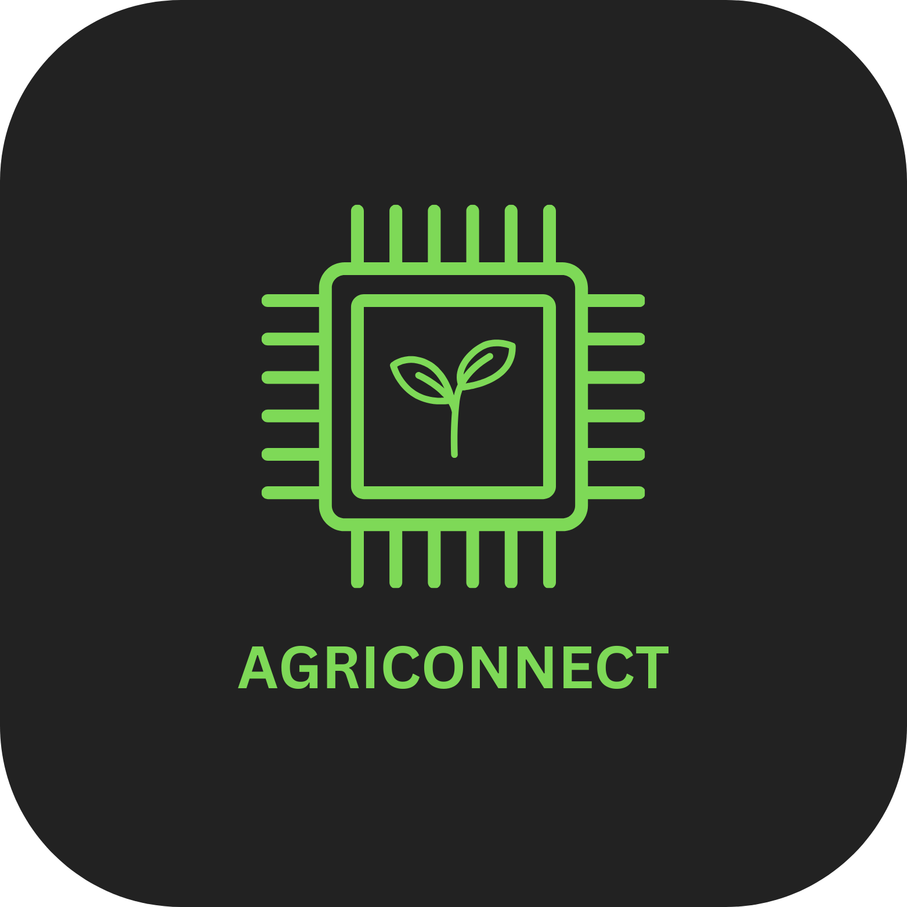

## Tentang AgriConnect

AgriConnect adalah platform inovatif untuk petani tebu di Sidoarjo yang memanfaatkan teknologi IoT dan AI untuk memaksimalkan hasil panen. Kami percaya bahwa teknologi dapat memberikan pengalaman bertani yang lebih efisien dan memberdayakan para petani menuju masa depan yang lebih baik.

Website ini dibangun menggunakan framework Laravel, yang memberikan sintaks ekspresif dan elegan, memudahkan pengembangan aplikasi web yang kokoh dan bertenaga.

### Fitur AgriConnect

- Sistem [IoT dan sensor pintar](https://agriconnect.my.id) untuk monitoring lahan secara real-time.
- Algoritma AI untuk membantu pengambilan keputusan pertanian.
- Penjualan hasil panen langsung ke pasar melalui platform kami.
- Peningkatan produktivitas dengan bantuan teknologi modern.

## Cara Memulai dengan AgriConnect

Untuk mulai menggunakan AgriConnect, kunjungi [agriconnect.my.id](https://agriconnect.my.id) dan daftarkan diri Anda sebagai petani. Platform kami menyediakan panduan untuk menggunakan layanan kami secara efektif.

## Kunjungi Kami

Untuk informasi lebih lanjut, kunjungi website kami di [agriconnect.my.id](https://agriconnect.my.id).
